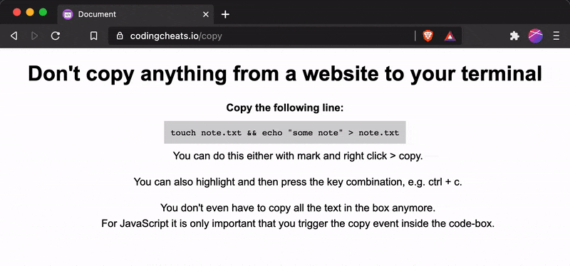

  

  <h3 align="center">Copy Guard</h3>

  

    A simple browser extension that warns you when your copy action was hijacked.
  

  
  

    
    
    
  

  

    
  

## About

This extension warns you whenever your copy action was hijacked. When you select text and copy it, this extension will compare your selection with the data that was added to your clipboard. If there is a difference, a native notification will be triggered.

## Features

- [x] Warns you when Javascript alters your clipboard data after copying
- [x] Warns you when the selection you copied contains hidden elements
- [ ] Whitelist or blacklist websites (coming soon)

## Building

1.  Clone repo
2.  `yarn`
3.  `yarn dev` to run the dev task in watch mode
4.  `yarn build` to build a production (minified) version

## Testing in Chrome

1.  Complete the steps to build the project above
2.  Go to [_chrome://extensions_](chrome://extensions) in Google Chrome or [_brave://extensions_](brave://extensions) in Brave.
3.  With the developer mode checkbox ticked, click **Load unpacked extension...** and select the _dist_ folder from this repo

## Testing in Firefox

1.  Complete the steps to build the project above
2.  Run `yarn start:firefox` and a Firefox window will open with the extension installed.
